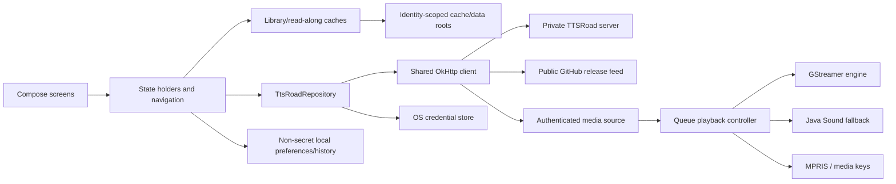

# Maintainer guide

This is the operational map for changing, testing and releasing TTSRoad Desktop. The ADRs explain
why individual decisions exist; this guide explains how the pieces fit and which gates a maintainer
must run.

## Support boundary

- **Supported release target:** Linux Mint 22.x on amd64. CI builds against Ubuntu 24.04, Mint
  22's ABI base, and installs/upgrades/removes the Debian package in a clean Ubuntu 24.04 container.
- **Build-and-smoke targets:** Windows x64 MSI and macOS DMG. Their native credential stores and
  fallback playback paths are tested, and release CI builds and starts their application images,
  but they do not have clean-machine installer lifecycle coverage. Do not describe them as fully
  supported until that changes.
- **Source runs:** any platform with a JDK 17+ capable of starting Gradle; Gradle provisions JDK 25.

## Architecture



`AppContainer` is the composition root. `App` owns long-lived state above destinations; screens
render state and send intent back to holders/controllers. The repository is the only typed server
API boundary. The shared HTTP client is also used for audio and update checks so the auth
interceptor's origin rule covers every outbound path. Playback engines never own the queue, retry,
progress or session-expiry policy; `QueuePlaybackController` does, which keeps it testable without
audio hardware.

## API and capability contract

Two endpoints are public and explicitly opt out of bearer injection: `POST /api/mobile/login` and
`GET /api/mobile/capabilities`. All other TTSRoad requests are authenticated, and a 401 ends the
whole local session. Authorization is attached only when scheme, host and effective port match the
signed-in origin.

Baseline endpoints are login/logout, `/me`, library, fiction chapters, progress and playback mark.
Optional surfaces must obey both gates: a literal boolean capability enables the UI, and an
endpoint 404 becomes a concise unsupported state. Never infer a feature from `api_version`.

| Capability | Consumer | Older-server behaviour |
| --- | --- | --- |
| `readalong` | reader + ETag cache | reader actions hidden |
| `search` | global metadata/narration search | server-search action hidden |
| `bookmarks` | manual marks and jump-back data | bookmark surface hidden/local history remains |
| `batch_progress` | progress outbox batch sync | single-item progress endpoint |
| `follows` | per-account shelf and browse-all | shared library, no follow controls |
| `device_management` | Settings device sessions | unsupported pane |
| `queue` | cross-library server queue | queue destination hidden |
| `delta_sync` | cursor-driven library/chapter metadata refresh | ordinary full refresh of both resources |
| `fiction_management` | admin add/edit/delete, gated *again* by `/me`'s `is_admin` | management controls hidden |
| `epub_upload` | multipart EPUB import, **never** inferred from `fiction_management` | the upload control is hidden; add-by-URL still works |
| *(no flag)* `POST /fictions/{id}/cover` | cover-art replacement from the metadata editor | additive route — a **404 is the only signal**, and it stops the control being offered |
| `audiobook_export` | read-only M4B export shelf and resumable save | Audiobooks pane hidden |
| `audio_content_hash` | reserved/parsed contract flag | no UI is promised merely by parsing |

Capability payloads are loose maps by design: unknown keys and non-boolean values cannot make the
whole response fail. Limits are server policy, not suggestions; honor them when batching.

## Storage and security boundaries

| Data | Location class | Lifetime |
| --- | --- | --- |
| bearer token | OS credential store only | removed on sign-out/revocation |
| server/account hints, window/listening/reader settings, history | platform config | retained across sign-out; no secrets |
| requested chapter downloads | platform data, server/account identity namespace | user-managed, never automatically evicted |
| streamed audio, library metadata, read-along text | platform cache, identity namespace | rebuildable and bounded |
| logs | platform state | redacted, owner-only, 1 MiB + three backups |

Raw titles, URLs and server filenames never become owned-storage path components. A signed-out
username hint is not authority to open account indexes. `SecureFiles` provides owner-only atomic
writes where the platform supports them. See ADR 0002 for credentials, ADR 0007 for storage and
ADR 0010 for update integrity.

## Contributor workflow and fixtures

Run the exact local gate from the repository root:

```bash
xvfb-run -a ./gradlew --no-daemon clean check --warning-mode fail -Pttsroad.warningsAsErrors=true
```

Omit `xvfb-run -a` on a workstation with a display. `ServerFixtures.kt` contains complete server
1.4.0 payloads and intentionally includes fields the client does not model. Repository tests use
MockWebServer for method/path/body/auth behaviour. `FakePlaybackEngine` drives queue, retry and
long-session cases without a sound card. Compose tests render real screens under a virtual display.
`packaging/linux/mock-mobile-server.py` is deliberately stdlib-only so the clean package container
can prove the installed login window reaches capability discovery.

When adding an endpoint, add a complete representative fixture or MockWebServer response, assert
the request shape and 401/404 distinction, add its literal capability parser, then cover the state
holder and rendered unsupported/error paths. Never make a fixture smaller merely to match a model;
unknown additive fields are part of the compatibility test.

## Release runbook

1. Merge only a green PR and complete the matrix in [QUALITY-GATE.md](QUALITY-GATE.md).
2. Set `ttsroad.version` once in `gradle.properties`, reset the Debian revision when appropriate,
   and add a matching non-empty `CHANGELOG.md` section.
3. Dispatch the **Release** workflow manually on the intended commit. This is the dry run: it runs
   Linux/Windows/macOS builds, tests, smoke launches, Linux package inspection and lifecycle, but
   publishes nothing.
4. Inspect every job and its installer/SBOM artifacts. A skipped platform or lifecycle job is not a
   successful dry run.
5. Push `v<ttsroad.version>` only after the dry run succeeds. The workflow rebuilds from that exact
   commit, creates checksums and signed provenance, and opens a draft release.
6. Verify the draft's notes and assets, then publish it manually. Never publish artifacts built
   outside the workflow or reuse artifacts from another commit.

The last recorded dry run and release results are linked from the quality gate. The release remains
a draft until a human checks it; the application update path verifies `SHA256SUMS` and hands the
installer to the OS without invoking a package manager.

## Dependency and incident maintenance

Dependabot groups Gradle and GitHub Actions updates weekly. Kotlin and its Compose compiler plugin
move together. For each update, run the full gate and packaged smoke path; for runtime/build-tool
changes, also dispatch the release dry run. Dependency Review rejects new high-severity advisories
when GitHub's dependency graph is enabled. Response targets and private reporting are in
[SECURITY.md](SECURITY.md).

Do not broaden an ignored advisory, lintian tag or test skip to make CI green without documenting
why the affected code cannot execute. A security fix takes priority over feature work according to
the SLA.

## Troubleshooting ownership

Start with `TTSRoad --diagnostics`, then the bounded platform-state log. Playback problems belong at
the media-source/engine boundary; session loss at the repository/auth boundary; stale UI at the
holder/cache boundary; package-only failures under `packaging/linux/`. Diagnostics and logs must
remain useful after redaction and must never contain a bearer token, a private URL path or a local
home path.
